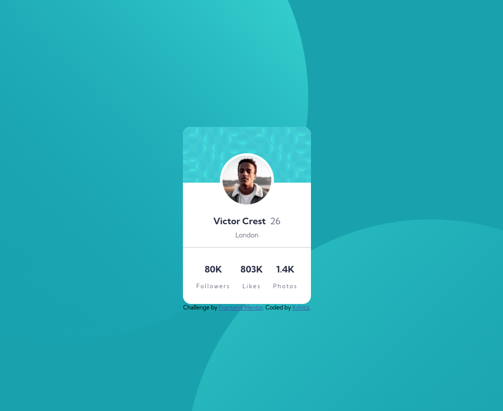

# Frontend Mentor - Profile card component solution

This is a solution to the [Profile card component challenge on Frontend Mentor](https://www.frontendmentor.io/challenges/profile-card-component-cfArpWshJ). Frontend Mentor challenges help you improve your coding skills by building realistic projects.

## Table of contents

-   [Overview](#overview)
    -   [The challenge](#the-challenge)
    -   [Screenshot](#screenshot)
    -   [Links](#links)
-   [My process](#my-process)
    -   [Built with](#built-with)

## Overview

### The challenge

-   Build out the project to the designs provided

### Screenshot

### Links

-   Solution URL: [Github](https://github.com/Kshitiz-Karki/frontendmentor_profile-card)
-   Live Site URL: [Github Pages](https://kshitiz-karki.github.io/frontendmentor_profile-card/)

## My process

### Built with

-   Semantic HTML5 markup
-   CSS custom properties
-   Flexbox
-   Mobile-first workflow
